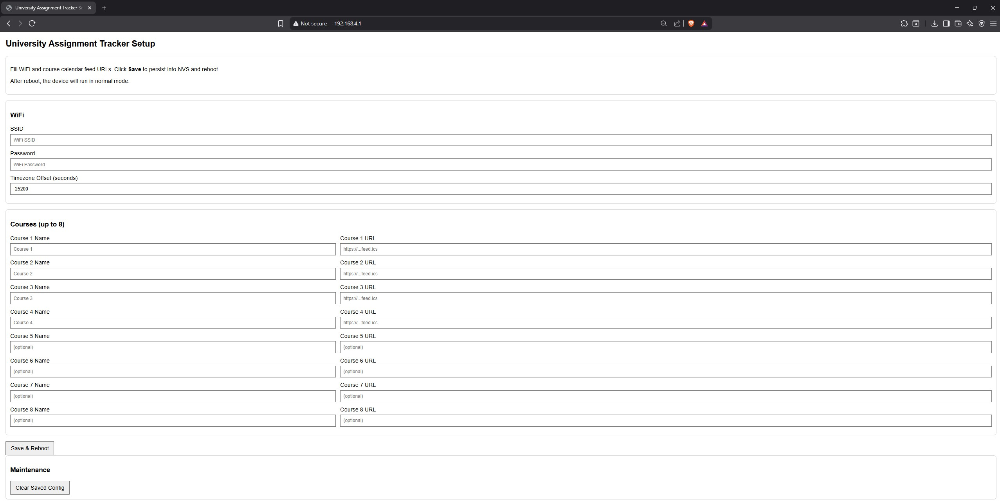

# 📚 University Assignment Tracker (M5Stack Paper)

A low-power, WiFi-enabled E-Ink dashboard that automatically tracks university assignments via iCal feeds.

Designed for long battery life, clean readability, and zero daily interaction.

---

## 📸 Interface Preview

### 🖥️ Assignment Dashboard
Displays assignments grouped by **Yesterday**, **Today**, and **Tomorrow**.  
Includes battery monitoring and online/offline status indicator.


---

### 🔧 Initial Setup Mode (Captive Portal)
Automatically launches on first boot if no configuration is stored.

Users submit:
- WiFi credentials  
- Course iCal URLs  


---

### 🌐 Web Configuration Portal
Accessible anytime via the on-screen gear icon to update settings.



---

## 🧠 System Overview

The device operates in three distinct modes:

1. **Initial Setup Mode (Captive Portal)**
2. **Automated Sync Mode**
3. **Active Interaction Window (5-minute session)**

After syncing and rendering, the system enters **deep sleep for 2 hours** to conserve battery.

System behavior and lifecycle are documented in:
- High-Level Architecture
- System Sequence
- Power & State Lifecycle

---

## 🔧 Hardware

- **Device:** M5Stack Paper v1.1 (ESP32)
- **Display:** 4.7" E-Ink (960x540)
- **Connectivity:** 2.4GHz WiFi
- **Touch Input:** GPIO 36 wake interrupt
- **Storage:** ESP32 NVS Flash

---

## 🚀 Features

### ⚙️ Smart Configuration
- Automatic first-boot captive portal
- Stores WiFi credentials and iCal URLs in NVS
- Reconfiguration available via gear icon

### 🔄 Automated Sync Loop
- Connects to WiFi
- Fetches `.ics` feeds
- Parses assignment events
- Converts UTC → Local Time (Calgary / MST)
- Renders grouped dashboard

### 🖥️ Dynamic E-Ink Dashboard
- Groups assignments:
  - Yesterday
  - Today
  - Tomorrow
- Page navigation via touch arrows
- Online / Offline status indicator
- “No assignments found” fallback state
- Battery voltage monitoring

### 🔋 Power Optimization
- 5-minute active interaction window
- Deep sleep every 2 hours
- Touch wake-up supported
- Timer wake-up supported

---

## 🏗️ Architecture

System responsibilities are modular and separated:

| Module | Responsibility |
|--------|----------------|
| Connectivity | WiFi connection + iCal fetching |
| Memory | Persistent NVS configuration storage |
| Management | Boot logic + power state transitions |
| Display | E-Ink rendering + UI handling |

This separation simplifies future refactoring and testing.

---

## 🔁 Execution Flow

### Cold Boot (Unconfigured)
1. Start captive portal
2. User submits WiFi + iCal URLs
3. Save configuration to NVS
4. Restart into runtime mode

### Runtime Loop
1. Connect to WiFi
2. Fetch `.ics` feeds
3. Parse and convert time
4. Render dashboard
5. Start 5-minute active session
6. Enter deep sleep

### Active Session
- Tap arrows → Navigate pages
- Tap gear → Re-enter configuration
- Inactivity timeout → Auto sleep

---

## 🛠 Setup

1. Clone this repository  
2. Create `src/secrets.h`:

```cpp
#define WIFI_SSID "YOUR_WIFI_NAME"
#define WIFI_PASS "YOUR_WIFI_PASS"
